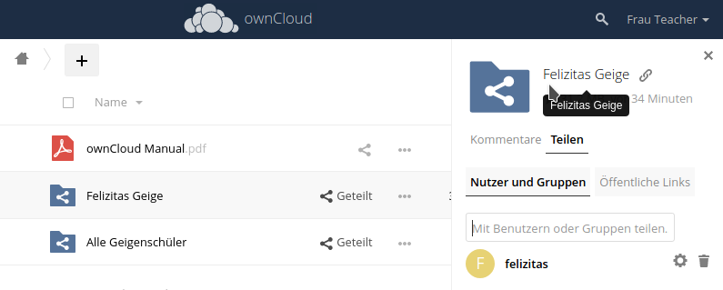

eTraining
=========

Lange wurde über eLearning diskutiert, und wenig gemacht. Jetzt brauchen wir dringend eine Lösung, daher soll dieser Blog zeigen, was hier mit einer normalen ownCloud Installation zu erreichen ist, ohne dass langes Kennenlernen der Plattform für alle Beteiligte nötig ist.

Es wird eine wirklich einfache Variante gezeigt, mit der aber schon erstaunlich viel möglich ist.

Das besondere ist, dass wir nicht nur Inhalte zur Verfügung stellen können (das ist, was auf Youtube passiert), sondern dass es einen Weg zurück gibt, mit dem Schüler ihre Ergebnisse zur Ansicht zurück geben können. Darüberhinaus gibt es noch eine einfache, schriftliche Dialog-Möglichkeit um einzelne Dateien.

Damit besteht eine Feedback Schleife zwischen Schüler und Lehrer, die zwar natürlich immer noch nicht an den persönlichen Unterricht heranreicht, aber besser als nichts ist.

Dieses System sollte nicht nur Schullehrern helfen, sondern auch zb. Physiotherapeuten, die damit den Patienten per Video etwas zeigen können und Hinweise auf Basis der zurückgeschickten Dateien geben können.

## ownCloud als eTraining Platform

ownCloud ist eine open source Infrastruktur zum Betreiben von sog. privaten Cloud-Speicher. Mit seinen Möglichkeiten zur Zusammenarbeit bietet es alles, was in für die Aufgabenstellung einfaches eTraining notwendig ist.

### Dateien teilen

ownCloud als private Cloud stellt als zentralen Baustein der ganzen Idee das sog. *File Sharing* zur Verfügung. Das bedeutet, das ein Benutzer in der Cloud einem anderen sehr einfach Zugriff auf seine Dateien geben kann.

Praktisch legt der Lehrer für jeden seiner Schüler ein Verzeichnis an, in das Dokumente oder Videos für einen Schüler gespeichert werden. Mittels des *File Sharings* kann der Lehrer dieses Verzeichnis nun per Klick mit dem entsprechenden Schüler teilen. Das bedeutet, das das Verzeichnis des Lehrers im Account des Schülers "auftaucht".

Der Schüler   hat damit Zugriff auf den Inhalt, den der Lehrer für ihn zur Verfügung gestellt hat. Er kann Dokumente herunterladen und Videos ansehen.

### Feedback

Nun  ist es aber auch möglich, dass der Schüler eine Datei in den vom Lehrer geteilten Folder zurücklegt. Das geschieht durch Hochladen einer Datei in das Verzeichnis. Das kann zb. ein bearbeitetes und gescanntes Papier sein, oder ebenfalls ein Video.

Der Lehrer kann nun nachvollziehen, was der Schüler mit den Lerninhalten erreicht hat und seinerseits Feedback geben.

### Kommentare

Ein in diesem Zusammenhang nützliches Feature ist die Kommentar-Funktion, die ownCloud auf Datei-Ebene zur Verfügung stellt. Damit können von jedem Benutzer Kommentare zu einer Datei geschrieben werden.

Im Falle der geteilten Dateien ist dann ein einfacher Dialog um bestimmte Dateien einfach möglich.

## Ausblick

ownCloud hat als erfolgreiches open source Projekt noch eine Vielzahl von mehr Möglichkeiten, aber mit diesen wenigen Schritten sollte schon ein rudimentärer eTraining Ablauf möglich sein, der Schüler und Lehrer wieder zusammenbringt.

Weitere Features wie File-Tags, Gruppenmanagement, Ablaufdaten etc. können im weiteren Verlauf hinzugenommen werden.

